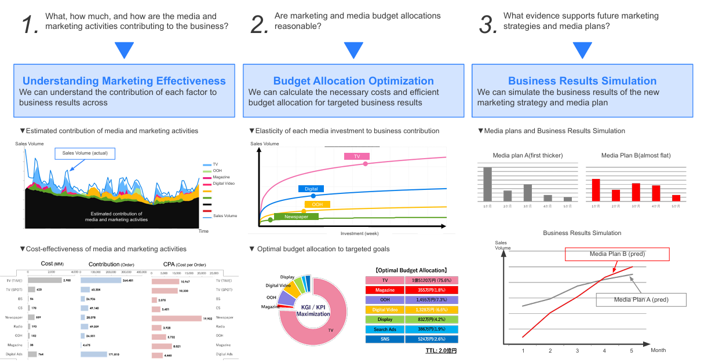
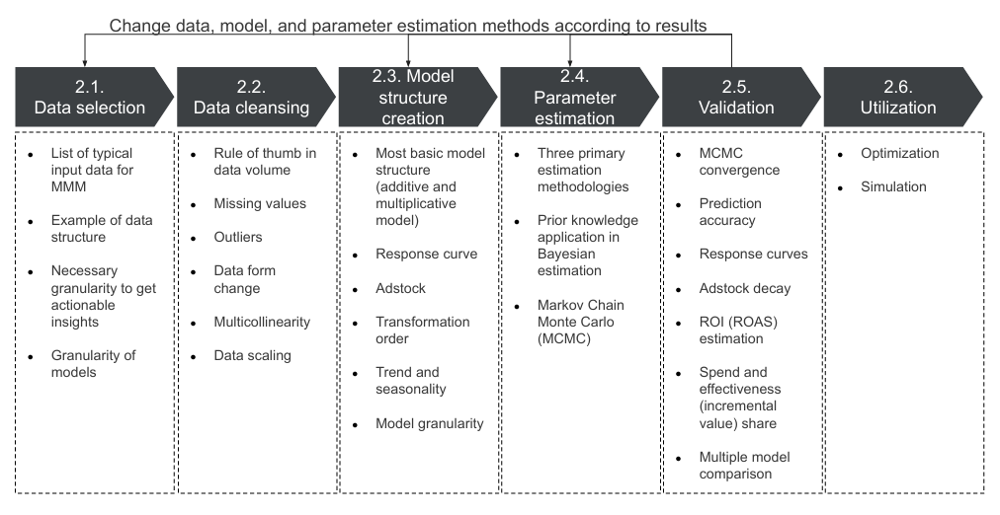

# 📘 Fundamentals of Marketing Mix Models (MMMs)

## ❓ What are MMMs?

Marketing Mix Models (MMMs) are statistical models used by marketers to measure the impact of various marketing activities (like TV, radio, digital, print, pricing, promotions, etc.) on key business outcomes such as sales, brand awareness, or customer acquisition.

## 🎯 Why are MMMs important?

Advertisers need to understand the effectiveness of their media spend in driving sales in order to optimise budget allocations.

However, tracking and attribution have become more difficult as privacy concerns have grown. Media mix models are a common and widely used approach for understanding marketing effectiveness without compromising user privacy.

## ⚙️ How do MMMs work?

An MMM is usually built as a regression model, where sales (or another KPI) is the dependent variable, and marketing activities and control variables are the independent variables.

$$
Y_t = \beta_0 + \sum_{m=1}^{M} \beta_m \cdot f(X_{t,m}) + \sum_{c=1}^{C} \beta_c \cdot Z_{t,c} + \epsilon_t
$$

### 🔍 Explanation of Variables

- $$Y_t$$: Outcome variable at time $$t$$  
  _e.g. sales, conversions, or revenue_

- $$β₀$$: Intercept term  
  _The baseline level of the outcome when all inputs are zero_

- $$X_{t,m}$$: Media variable $$m$$ at time $$t$$  
  _e.g. spend on TV, search, or social media_

- $$f(X_{t,m})$$: Transformation function applied to media inputs  
  _Usually includes adstock (to model lagged effects) and saturation (to model diminishing returns)_

- $$βₘ$$: Coefficient for media variable $$m$$  
  _Represents the effectiveness or contribution of media channel m to the outcome_

- $$Z_{t,c}$$: Control variable $$c$$ at time $$t$$  
  _e.g. seasonality, holidays, pricing changes, competitor activity_

- $$β_c$$: Coefficient for control variable $$c$$  
  _Measures the impact of external or non-media factors_

- $$ε_t$$: Error term  
  _Captures noise or unexplained variation in the outcome variable_

## How are MMMs used in practice?

MMMs attempt to answer causal questions for the advertiser. For example: 1) What was my ROAS on TV last year? 2) What would my sales be if more or less money were spent next year? 3) How should my media budgets be allocated to maximise sales? Here is how they are used in practice:

### 1. To Measure Marketing ROI (Marketing effectiveness)
They help determine which channels drive results, and how much return each channel brings relative to spend.

### 2. To Optimise Media Budgets (Budget Allocation Optimization)
MMMs inform budget allocation by identifying diminishing returns and optimal spend levels.

### 3. To Inform Strategic Planning (Business results Stimlulation)
By simulating “what-if” scenarios, MMMs allow teams to model the impact of different marketing strategies before implementing them.

### Example of MMM Outputs

 

## What is the typical MMM modelling process?

Generally the marketing mix modeling process consists of data selection, data cleansing, model structure creation, model creation, validation and utilization. While some steps are consistent with general regression models, there are MMM specific 
considerations such as input data selection, response curve transformations, adstock and the validation of the results.

 

## What are alternative considerations to MMMs?

  Typically though, MMMs are regression models based on a limited amount of aggregated observational data and such models produce correlational, not causal results. It is only under certain narrow conditions that these estimates can be considered causal.

  The two approaches that can be used by the advertiser to answer causal questions around their advertising effectiveness are Randomized experiment and Potential outcome analysis. However these approaches can be infeasible or impractical for advertisers, which is why they turn to using MMMs.

### Randomized Experiments

The generally accepted gold standard for answering causal questions is to perform a randomized experiment. A randomized experiment answers the question of what will happen if an advertiser did action X, by randomly splitting a population into a test group, where the action X is performed and a control group, where no action is taken.

The randomization controls for all other sources of variation, so that statistically, the only difference between the test and control groups is the action X. We can then say that action X caused any observe change in outcome between the two group.
Randomized experiments can be conducted at different levels, such as individual users, stores, or geographic regions, depending on how precisely action X can be targeted and outcomes tracked. For example, a streaming service could test personalized recommendations at the user level, while a retailer might run a paid search ad campaign at the geographic level to measure the effectiveness of the ad.

Randomized experiments are ideal but not always practical —In order to answer a similar set of questions that MMMs answer, the advertiser may need to run many experiments with many different conditions over time. For example, suppose an advertiser expects a MMM to inform on the effectiveness of an ad channel at various levels of ad spend, not just at one level of ad spend. The advertiser may also use a MMM to optimize media budgets which will require many experiments to answer. For most, if not all advertisers, this is infeasible.

Other barriers to adoption of randomized experiments include technical hurdles in implementation, lost opportunity costs from having a control group, costs of having a test group, and weak advertising effects which may require very large sample sizes.

- Technical hurdles: Implementing experiments can be complex, requiring system changes and technical resources to integrate at scale.

- Lost opportunity costs: Control groups miss out on potential benefits, which may lead to lost revenue or engagement.

- Cost of a test group: Running an experiment often involves direct costs, such as discounts or incentives, regardless of success.

- Large sample sizes: When advertising effects are small, experiments require a vast number of participants to yield reliable insights.

> Example of randomized experiments in practice include a/b tests and geo-experiments.

### Potential Outcome

If advertisers can’t run randomized experiments at scale and are therefore reliant on historical data, then they might try to derive causal conclusions via the potential outcomes framework, also known as the Rubin causal model for causal inference.

Suppose we want to estimate the ROAS of a single ad channel for an advertiser and the ad channel is either on or off during each time period _t_. The challenge is that only one potential outcome is observed for each time period. A naive estimate would be to compare sales in the periods when the ad channel was on, to sales in the periods when the ad channel was off.

However, the naive estimate introduces selection bias because, due to the different time periods, many factors influencing ad spend — such as advertiser decisions, customer behaviour, or competitor actions — are not controlled and vary in degree of influence. If higher ad spend tends to coincide with periods of high demand, simply comparing sales across periods would overestimate the ad’s true impact.

It is this selection bias that makes trying to answer causal questions with observational data one of the most demanding problems in applied statistics. This selection bias needs to be accounted for in order to produce a valid causal result. One way to control for selection bias is through the use of the matching estimator.

A matching estimator is a way to measure the causal effect of a treatment (e.g., running an ad) by comparing treated and untreated cases that are as similar as possible based on control variables (e.g., other ad channels, seasonality).

> Example of Potential outcome in practice include Causal Impact Analysis

---

## 📚 References

- https://research.google/pubs/challenges-and-opportunities-in-media-mix-modeling/
- https://www.thinkwithgoogle.com/_qs/documents/18374/Marketing_Mix_Modeling_Guidebook.pdf
