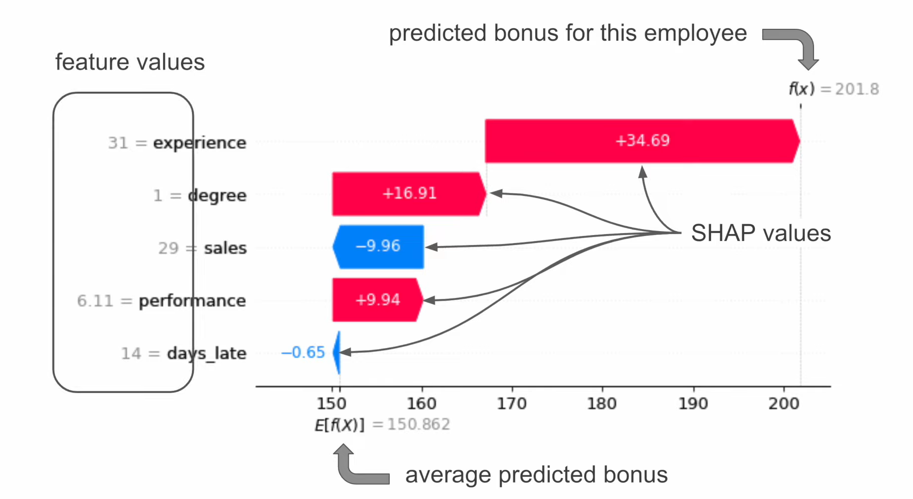

# Shapley Values

- used to explain individual model predictions.
- it tells us how each feature has contributed to that prediction.
- It tells us how the model feature has increased or decreased a prediction
- Shap can help answer questions like "how does the model work?" and "how each feature change the prediction?"
- Shap offers additional benefit over feature importance:
    - Individual predictions: SHAP explains why a specific prediction was made by showing each feature's contribution to that prediction — feature importance only shows general global trends.
    - Increased or Decreased Prediction: SHAP indicates whether each feature increased or decreased the model's output (e.g. log-odds or score) for a given instance. feature importance lacks this directionality.
    - Change in Probability of Positive Class (Classification): SHAP can be used to quantify how much each feature shifted the probability of the positive class from the base value — traditional feature importance doesn’t connect features to probability changes.
- The example of below is a shap waterfall plot for an employee for a model that predicts employee bonus.
  

where:
- On the top right is the f(x), which is the predicted bonus for the specifc/individual employee
- on the bottom is E[f(x)], which is the average predicted bonus across all employees
- The shap values tells us how each feature contributed to prediction when compared to the average prediction.
- The numbers for the features are the feature value for the individual
- If we take the degree feature as an example, we can see that the shap value for having a degree (degree = 1) is +16.91, this can be interpretated as 'since the employee has a degree the employee bonus is $16.91 higher than the average predicted bonus". In order words, degree has increased the prediction by $16.91.
- NB: keep in mind it is the features value in the context of the other feature values that has led to the shap value for that feature, the shap value for degree can change depending on which employee you're looking at, that is even if all the employees you look at have a degree.

Consider a classification problem that looks at predicting whethwe a mushroom is poisonous or edible. Shap values can be used to understand how each feature has changed the predicted probability that a mushroom is poisonous (true).  More specifically, we interpret the shap values in terms of log odds. 

  
