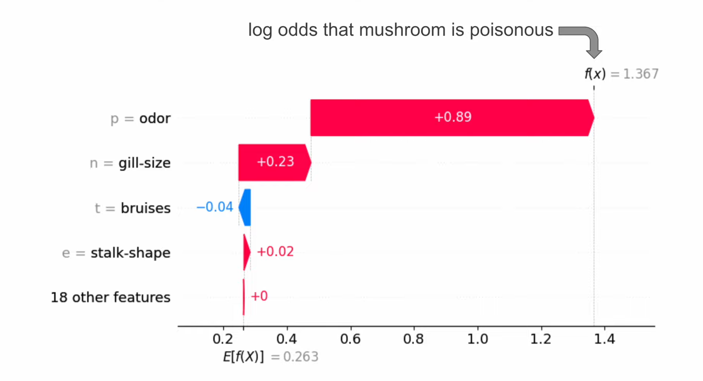
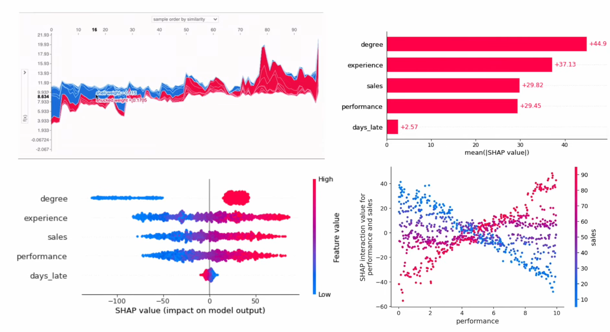

# Shapley Values

- used to explain individual model predictions.
- it tells us how each feature has contributed to that prediction.
- It tells us how the model feature has increased or decreased a prediction
- Shap can help answer questions like "how does the model work?" and "how each feature change the prediction?"
- Shap offers additional benefit over feature importance:
    - Individual predictions: SHAP explains why a specific prediction was made by showing each feature's contribution to that prediction — feature importance only shows general global trends.
    - Increased or Decreased Prediction: SHAP indicates whether each feature increased or decreased the model's output (e.g. log-odds or score) for a given instance. feature importance lacks this directionality.
    - Change in Probability of Positive Class (Classification): SHAP can be used to quantify how much each feature shifted the probability of the positive class from the base value — traditional feature importance doesn’t connect features to probability changes.
- The example of below is a shap waterfall plot for an employee for a model that predicts employee bonus.
  

where:
- On the top right is the f(x), which is the predicted bonus for the specifc/individual employee
- on the bottom is E[f(x)], which is the average predicted bonus across all employees
- The shap values tells us how each feature contributed to prediction when compared to the average prediction.
- The numbers for the features are the feature value for the individual
- If we take the degree feature as an example, we can see that the shap value for having a degree (degree = 1) is +16.91, this can be interpretated as 'since the employee has a degree the employee bonus is $16.91 higher than the average predicted bonus". In order words, degree has increased the prediction by $16.91.
- NB: keep in mind it is the features value in the context of the other feature values that has led to the shap value for that feature, the shap value for degree can change depending on which employee you're looking at, that is even if all the employees you look at have a degree.

Consider a classification problem that looks at predicting whethwe a mushroom is poisonous or edible. Shap values can be used to understand how each feature has changed the predicted probability that a mushroom is poisonous (true).  More specifically, we interpret the shap values in terms of log odds. 

where:
- on the top right f(x) is the log odds the individual mushroom is poisonous at 1.367.
- The average predicted log odds across all mushrooms is 0.263.
- The odor of the specific mushroom has increased the predicted log offs by 0.89. In other words, the smell means its more likely we predit this mushroom is poisonous.

Generally, shap values tell us which features are most important to an individual prediction, but we can also combine or aggregate shap values from multiple predictions as well. There are plots that can be used to understand how model works as a whole.

The example shows the following plots:

- Top left - Force Plot:Visualises how individual feature contributions push the prediction above or below the base value.
- Top Right - Mean SHAP Plot: Shows the average absolute contribution of each feature to the model's predictions.
- Bottom left - Beeswarm Plot: Displays the distribution of SHAP values for each feature across all instances, including direction and magnitude.
- Bottom Right - Dependence Plot: Shows how a feature’s value affects its SHAP value, revealing its marginal effect on the prediction.

it is important to know why the model is making predictions:
- debugging - shap allows you to take a closer look at incorrect predictions and understand which features have caused the error we can also find cases where the model. Also extend to instances 
- explanations -  shap can provide the basis for human friendly explanations you may be cautious about the prediction that a mushroom is edible and rightly so that prediction can have serious consequences shap can be used to provide an explanation and increase trust in the model's prediction
- data exploration - a data set will contain all sorts of hidden patterns these include non-linear relationships and interactions Black Box models are really good at finding these patterns we can train a model on the data set and it will use these hidden relationships to make predictions when we interpret the model we learn what it is using to make those predictions sometimes we can learn something completely new in this way shap becomes a tool for data exploration and the knowledge we gain can go beyond the model for example building better model features for simple models like linear regression.

## Maths behind Shapey Values

- SHAP values explain how much each feature (or player) contributes to a machine learning prediction (or prize in a game). The math comes from Shapley values in cooperative game theory.

Intuitive Example

You and your friend win $10,000 in a Kaggle contest. You both want to split the prize fairly, but you think you contributed more (you used your GPU, after all!). You go back in time (with a time machine!) to simulate each of you competing alone.

| Player(s)      | Result    | Prize (\$) |
| -------------- | --------- | ---------- |
| You + Friend   | 1st place | 10,000     |
| You (alone)    | 2nd place | 7,500      |
| Friend (alone) | 3rd place | 5,000      |
| Nobody plays   | no result | 0          |

## Resources
- https://www.youtube.com/watch?v=MQ6fFDwjuco&t=1s

  
